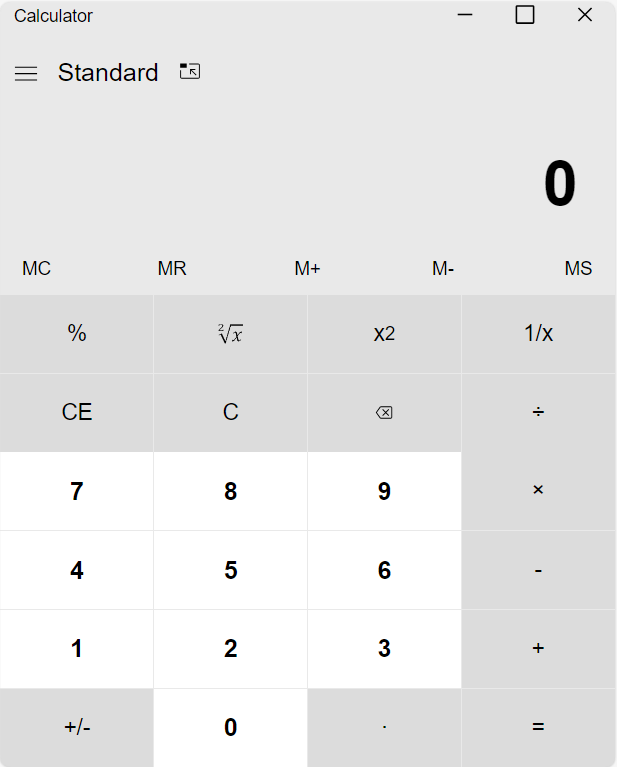

# Windows 10 Calculator

    In this  project, we need to build a calculator similar to the Windows 10 calculator using CSS, HTML, Flexbox, Grid, and JavaScript.

<h3>Step 1: Implement a Calculator Layout</h3>

  In this step, we should implement a calculator layout exactly like the Windows 10 calculator in maximum size (Standard mode) 
  The calculator will be unresponsive but resizable

 

 <h3>Step 2: Implement a Responsive Calculator</h3>

 

  In this step, we will make the calculator responsive just like the Windows 10 calculator. This means that the calculator will be able to adjust its layout based on the screen size of the device

<h3>Step 3: Make the Calculator Functional</h3>

  In this step, we'll add calculations to our calculator using JavaScript.

<h5>The history section and other calculations</h5>

<h5>Memory Functioning</h5>

<h4>Themeable Calculator</h4>

  In this substep, we will make the calculator themeable by adding a green and blue theme and pink theme.

